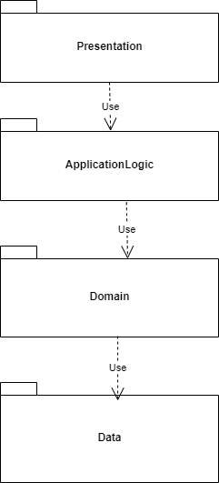
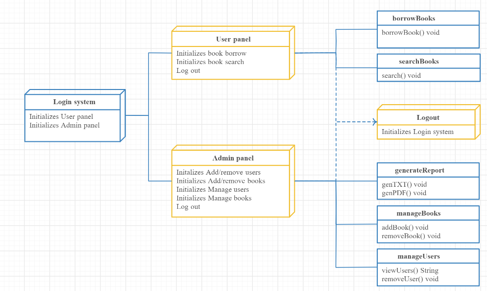
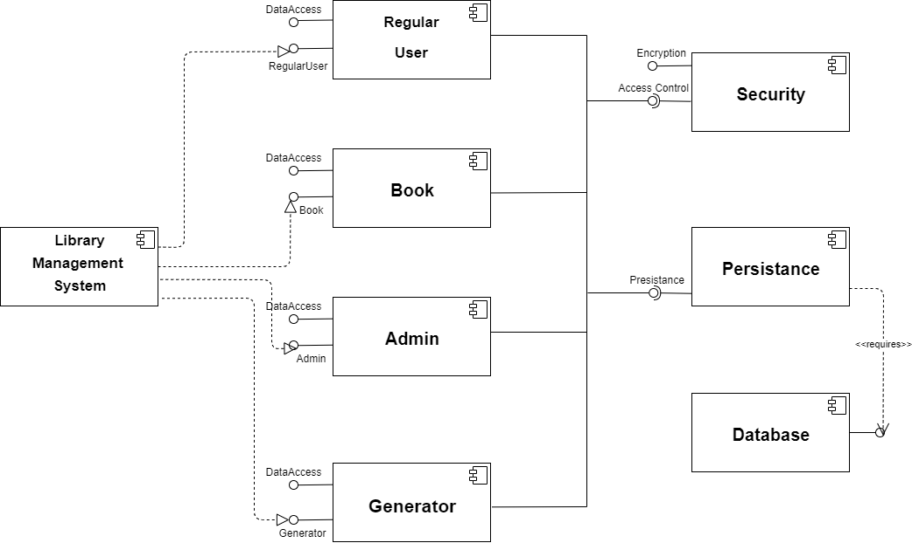
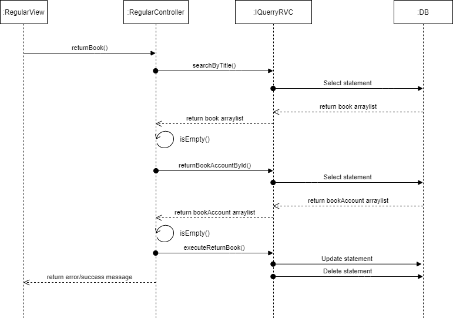
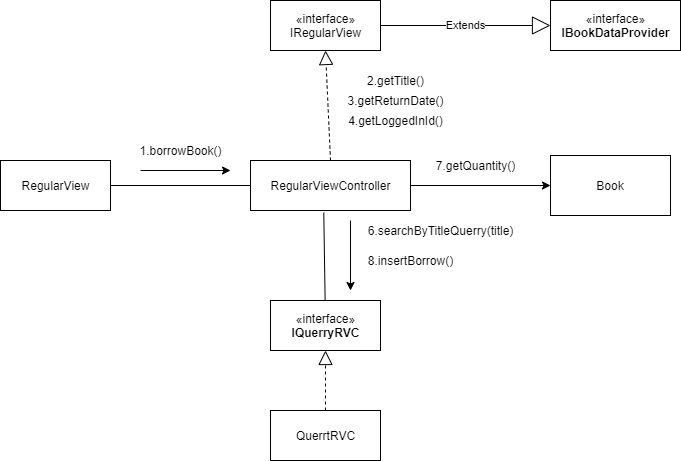
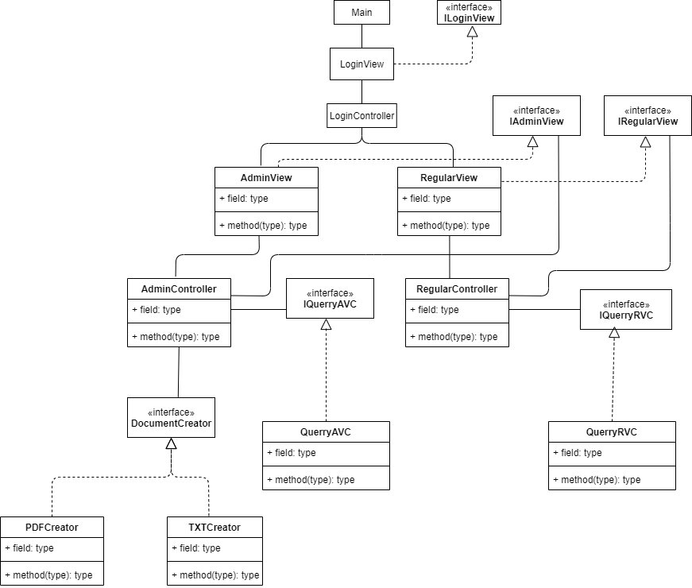

# Library Management Specification
Use Java or C# to design and implement a desktop application for Library Management. The application should have two types of users (a regular user and an administrator user) which have to provide a username and a password in order to use the application.

The regular user can perform the following operations:

* Search books by genre, title, author, time until return.
* Borrow books for a specific period and return them

The administrator can perform the following operations:

* CRUD on books (book information: title, author, genre, etc).
* CRUD on regular users' information.
* Generate two types of report files, one in pdf format and one in txt or html format, with the current books and their history (borrowed or not) The reports **need** to be saved in a **user-selected location** (not predefined by the application), similar on how one would save a file from Notepad.

# Elaboration – Iteration 1.1

## Domain Model
A Domain Model creates a web of interconnected objects, where each object represents some meaningful individual, whether as large as a corporation or as small as a single line on an order form. Domain model is a structured visual representation of interconnected concepts or real-world objects that incorporates vocabulary, key concepts, behavior, and relationships of all of its entities.

Classes in domain model will be: User, Book, RegularUser, Admin, History

## Architectural Design

### Conceptual Architecture	
Layered-Architecture

It's one of the most commonly used architecture pattern for the information-rich programs.

I choose this pattern because it helps me concentrate on a single thing when coding, for example when I'm working on the domain logic I can ignore the presentation layer. Also I can change one module any time I want without having to worry about the others modules too much, example, I can add multiple presentations on the top of the domain logic. In the presentation layer we will use MVC architecture.

MVC considers three roles. The model is an object that represents some information about the domain. It’s a nonvisual object containing all the data and behavior other than that used for the UI.  The view represents the display of the model in the UI. The controller takes user input, manipulates the model, and causes the view to update appropriately. In this way UI is a combination of the view and the controller.

### Package Design


### Component and Deployment Diagrams





# Elaboration – Iteration 1.2

## Design Model

### Dynamic Behavior
Return book - sequence diagram




Borrow Book - communication diagram



### Class Design
Clasele pentru view, controller, interfata prin care se apeleaza metodele de generare a raportului, aceste clase sunt accesibilie din Client, urmeaza sa fie implementata o clasa unde vom avea un mecanism care sa codeze si sa decodeze request-urile de la client si sa fie trimise in partea de server, adica clasele de genul QuerryAVC/RVC care sunt de fapt clasele ce implementeaza interfetele de service IQuerryAVC/RVC.  




### Data Model
A **data model** is an abstract model that organizes elements of data and standardizes how they relate to one another and to the properties of real-world entities. In this system, the data model (or domain model) is represented as Java classes and as database tables. 

<u>**Classes:**</u> Account, Book, BookAccount.

**Account:** id, username, password, isAdmin.

**Book:** id, genre, title, author, quantity.

**BookAccount:** id, accountID, bookName, returnDate, timeLeft.

### Unit Testing
A software test is a piece of software, which executes another piece of software. It validates if that code results in the expected state (state testing) or executes the expected sequence of events (behavior testing).

Software unit tests help the developer to verify that the logic of a piece of the program is correct.

Running tests automatically helps to identify software regressions introduced by changes in the source code. Having a high test coverage of your code allows you to continue developing features without having to perform lots of manual tests.

For each view state there is a testing class. For each method test we're using Mockito framework to mock interfaces, specify certain results for each method called, verify if the methods are used and if the results returned by the methods correspond to the results we're waiting.

# Elaboration – Iteration 2

## Architectural Design Refinement
[Refine the architectural design: conceptual architecture, package design (consider package design principles), component and deployment diagrams. Motivate the changes that have been made.]

All the changes were made due to the fact that the application was transformed into a Client-Server one.

**Package Diagram**


**Component Diagram**


**Deployment diagram**


## Design Model Refinement
[Refine the UML class diagram by applying class design principles and GRASP; motivate your choices. Deliver the updated class diagrams.]

**UML Diagram**


# Construction and Transition

## System Testing
​	For testing I used JUnit and Mockito. In order to make testing  easier with Mockito you can mock classes that you need to test. One example would be mocking interfaces for view and request in order to test the controller.

​	Let's take the example for borrowing a book. I'm going to explain the perfect case where all expectations are met. 

​	First two lines represent the view and request classes mocked used as parameters in controller.

​	Using the when().thenReturn() method assures us that when a certain method is called the desired data is returned. We follow all the method calls that are made in the borrowBook() method and set the desired return data. In order for the operation to be successful the view will show a modal with a certain message. After verifying that all the methods were called, we verify if the view called the method for displaying the  expected message.

```
@Test
void borrowBook_PerfectCase() {
    IRegularView regularView = mock(IRegularView.class);
    RegularVCRequest req = mock(RegularVCRequest.class);

    RegularViewController controller = new RegularViewController(regularView, req);

    when(regularView.getReturnDate()).thenReturn("12-AUG-2020");
    when(regularView.getLoggedInId()).thenReturn(1L);
    when(regularView.getTitle()).thenReturn("Poezii");

    List<Book> books = new ArrayList<>();
    Book bk = new Book("Drama", "Poezii", "Eminescu", 3);
    books.add(bk);

    when(req.searchByTitle("Poezii")).thenReturn(books);
    when(req.getSubs(1)).thenReturn(1);
    when(req.insertBorrow("1", "Poezii", "12-AUG-2020")).thenReturn(1);

    controller.borrowBook();

    verify(regularView).getTitle();
    verify(regularView).getReturnDate();
    verify(regularView).getLoggedInId();
    verify(regularView).showErrorMessage("Poezii borrowed successfully!");
}
```

​	That's how I tested most of the client functionalities, in order to test the model classes I used JUnit as follows:

```
@Test
void getUserName() {
    Account acc = new Account("user", "user", false);

    String username = acc.getUserName();

    assertEquals("user", username);
}
```

​	This example tests the method getUserName(), first we create an account with a certain name, than we create a string and set the value of this string to the tested method return data.

​	Using assertEquals(), we verify the results.

## Future improvements

​	This application could be improved by implementing better algorithms for speed and memory, or by using more design patterns. When it comes to user experience we could change the view layer, using something more attractive than the old Java Swing.

# Bibliography
- [Architectural Styles](https://docs.microsoft.com/en-us/azure/architecture/guide/architecture-styles/)
- [Architectural Patterns and Styles](https://msdn.microsoft.com/en-us/library/ee658117.aspx)
- [Design Patterns](https://sourcemaking.com/design_patterns)
- [Online diagram drawing software](https://yuml.me/) ([Samples](https://yuml.me/diagram/scruffy/class/samples))
- [Yet another online diagram drawing software](https://www.draw.io)
